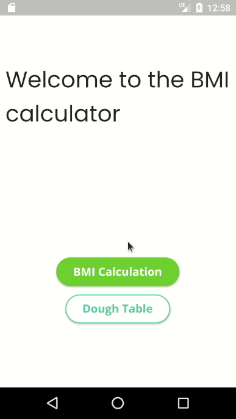
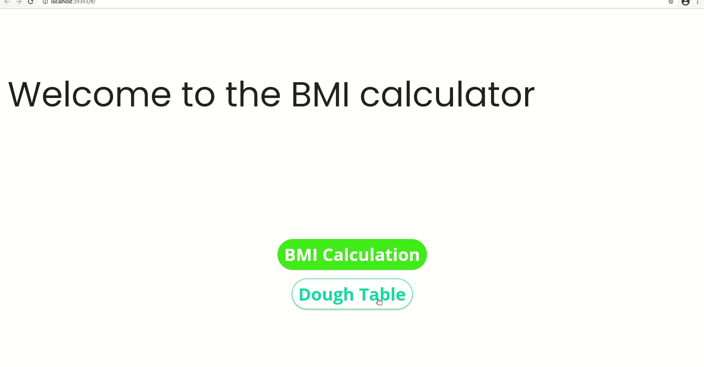

<h1 align="center">BMI</h1>

<h2 align="center">Flutter application BMI (Body Mass Index)</h2>

## Technologies

- [Flutter](https://flutter.dev)

## [Pub dev](https://pub.dev/) libraries
- [mobx](https://pub.dev/packages/mobx)

- [flutter_mobx](https://pub.dev/packages/flutter_mobx)

- [mobx_codegen](https://pub.dev/packages/mobx_codegen)

- [build_runner](https://pub.dev/packages/build_runner)

## Features

This project involves a simple responsive application in the calculation of BMI and its table. Mobx was used in its construction. I am aware that 'setState' would be sufficient and there was no need to use such a powerful state manager for something so simple, but here is an example that even in simple tasks it is a powerful tool. The application was run on an Android device and on the Web (Chrome) in order to test its responsiveness.

## Run App

<h3>Android</h3>

  

### Web

  

### Author
Moisés Cunha

### Contact
Email: moisescunhapimentel@gmail.com

